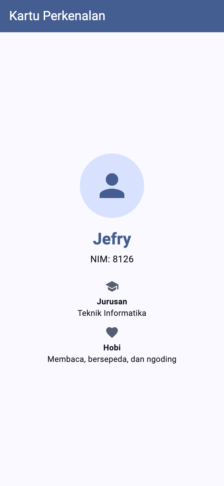

# Tugas Pertemuan 1 — Kartu Perkenalan

Aplikasi satu halaman yang menampilkan kartu perkenalan berisi foto/ikon, nama, NIM, jurusan, dan hobi.

- **Kode:** [`../tugas1/lib/main.dart`](../tugas1/lib/main.dart)
- **Materi:** widget dasar, `StatelessWidget`, layout `Column`
- **Modul:** [Pertemuan 1](../modul/modul-praktikum-flutter-pertemuan-1.pdf), bagian 6 (Tugas)

## Tangkapan Layar



## Pemenuhan Ketentuan Tugas

| Ketentuan modul | Implementasi |
|---|---|
| Satu halaman | `KartuPerkenalanPage` sebagai `home` dari `MaterialApp` |
| Menampilkan foto/ikon | `CircleAvatar` berisi `Icon(Icons.person)` |
| Menampilkan nama, NIM, jurusan, hobi | `Text` untuk nama dan NIM; widget `BarisInfo` untuk jurusan dan hobi |
| Memakai `Column`, `Text`, `Icon`, `SizedBox` | Semua elemen disusun vertikal dalam `Column` dengan jarak `SizedBox` |

## Struktur Kode

```
tugas1/
├── lib/main.dart          # seluruh aplikasi
└── test/widget_test.dart  # pengujian widget
```

| Bagian | Keterangan |
|---|---|
| Konstanta `nama`, `nim`, `jurusan`, `hobi` | Data kartu di bagian atas berkas; ganti nilainya dengan data Anda sendiri |
| `MyApp` | `MaterialApp` dengan tema dari `ColorScheme.fromSeed` |
| `KartuPerkenalanPage` | Tata letak kartu: avatar, nama, NIM, lalu dua `BarisInfo` |
| `BarisInfo` | Widget kecil yang dapat dipakai ulang: ikon + label tebal + isi |

Warna diambil dari `Theme.of(context).colorScheme`, jadi tampilan otomatis menyesuaikan bila `seedColor` diganti.

## Cara Menjalankan

```bash
cd pert1/tugas1
flutter pub get
flutter run
```

## Pengujian

```bash
flutter test
```

| Test | Yang diperiksa |
|---|---|
| Kartu menampilkan nama, NIM, jurusan, dan hobi | Keempat data tampil di layar |

Hasil: semua test lulus; `flutter analyze` tanpa masalah.
