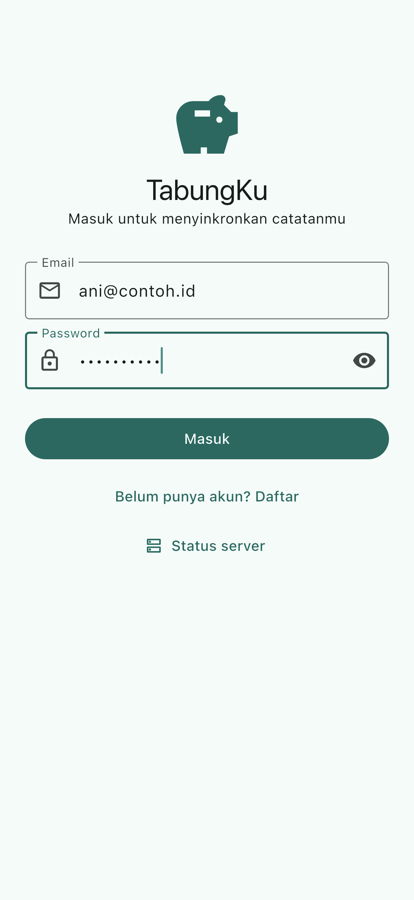
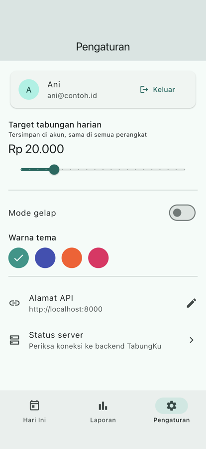

# Tugas Pertemuan 10 — Refresh Token dan Auto-Logout

Autentikasi JWT (Argon2, register/login/profil, isolasi data per pengguna) ditambah refresh token. Di Flutter, `ApiClient` memperbarui token otomatis saat menerima 401 dan keluar otomatis bila refresh ditolak.

- **Kode:** [`../tugas10/`](../tugas10/) — `backend/app/routers/auth.py`, `mobile/lib/services/api_client.dart`
- **Modul:** [Pertemuan 10](../modul/modul-praktikum-flutter-pertemuan-10.pdf), bagian 6 (Tugas)

## Tangkapan Layar

| Login | Akun di Pengaturan |
|---|---|
|  |  |

## Pemenuhan Ketentuan Tugas

| Ketentuan | Implementasi |
|---|---|
| Access 15 menit, refresh 7 hari (dari `.env`) | `ACCESS_TOKEN_MENIT`, `REFRESH_TOKEN_HARI` di compose dan `Settings` |
| Payload `jenis`; refresh token ditolak sebagai akses | `_buat_token()` + cek `payload["jenis"] != "access"` di `get_current_user` |
| `POST /auth/refresh` | Membalas pasangan baru; menolak access token (401) dan akun nonaktif (403) |
| 401 → refresh → ulangi request sekali | `ApiClient.send()` menyalin `http.Request` sebelum dikirim agar bisa diulang |
| Refresh ditolak → auto-logout | `hapusSesi()` sehingga `MyApp` kembali ke `LoginPage` |
| Server mati saat refresh → tidak logout | `_refresh()` mengembalikan `null` untuk galat jaringan |
| Request bersamaan hanya satu refresh | `static Future<bool?>? _sedangRefresh` dipakai bersama |
| 401 dari `/auth/login` tidak memicu refresh | Path berawalan `/auth/` dikecualikan |
| Bukti isolasi data | Ani: `GET /kegiatan` → `[]`, `DELETE` milik Budi → 404, laporan Ani tidak memuat data Budi |

## Hasil Verifikasi

- Uji `curl`: email ganda 409, password salah 401, tanpa token 401, token palsu 401, refresh token sebagai akses 401, access token di `/auth/refresh` 401.
- `flutter test`: 28 test lulus, termasuk `api_client_test.dart` (5 skenario refresh).
- APK debug dengan `flutter_secure_storage` berhasil di-build.
