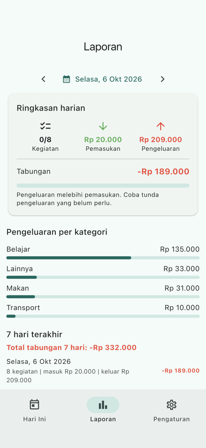

# Tugas Pertemuan 11 — Target di Server dan Mode Offline

UI TabungKu kini memakai data server lewat *repository pattern* (`ApiKegiatanRepository`; SQLite tetap tersedia dengan `--dart-define=MODE_DATA=lokal`). Tugas menambahkan target tabungan yang tersimpan di akun dan cache offline *network first*.

- **Kode:** [`../tugas11/`](../tugas11/) — `mobile/lib/data/`, `mobile/lib/services/cache_client.dart`
- **Modul:** [Pertemuan 11](../modul/modul-praktikum-flutter-pertemuan-11.pdf), bagian 6 (Tugas)

## Tangkapan Layar

| Laporan dari API (2 request paralel) |
|---|
|  |

> Banner mode offline perlu diambil langsung: buka aplikasi sekali saat online, jalankan `docker compose stop api`, lalu tarik untuk menyegarkan.

## Pemenuhan Ketentuan Tugas

| Ketentuan | Implementasi |
|---|---|
| `PATCH /users/me` (`nama`, `target_harian` 0–10 jt) | Skema `UserUpdate`, `exclude_unset` |
| Slider menyimpan ke server, kembali bila gagal | `simpanTarget()` memanggil `AuthApi.ubahTarget()`; SnackBar saat galat |
| Target mengikuti akun yang login | `ikutiTargetAkun()` mendengarkan `pengguna` |
| `CacheStore` SQLite + versi memori | `lib/data/cache_store.dart` (`tabungku_cache.db`) |
| `CacheClient`: GET 200 disimpan, galat jaringan memakai cache | `lib/services/cache_client.dart`, `statusOffline` berisi waktu data |
| Kunci = id pengguna + URL; cache dihapus saat keluar | `'${pengguna.value?.id}\|${request.url}'`; `hapusSesi()` memanggil `cacheStore.hapusSemua()` |
| Banner offline | `ShellPage` di atas `IndexedStack` |
| Unit test | `test/cache_client_test.dart` (6 skenario) + test `ubahTarget` |

## Hasil Verifikasi

- `flutter test`: 39 test lulus, termasuk widget test `BerandaPage` dengan `FakeRepository`.
- `PATCH /users/me` diuji dengan `curl`: 25.000 diterima, -5 ditolak 422.
