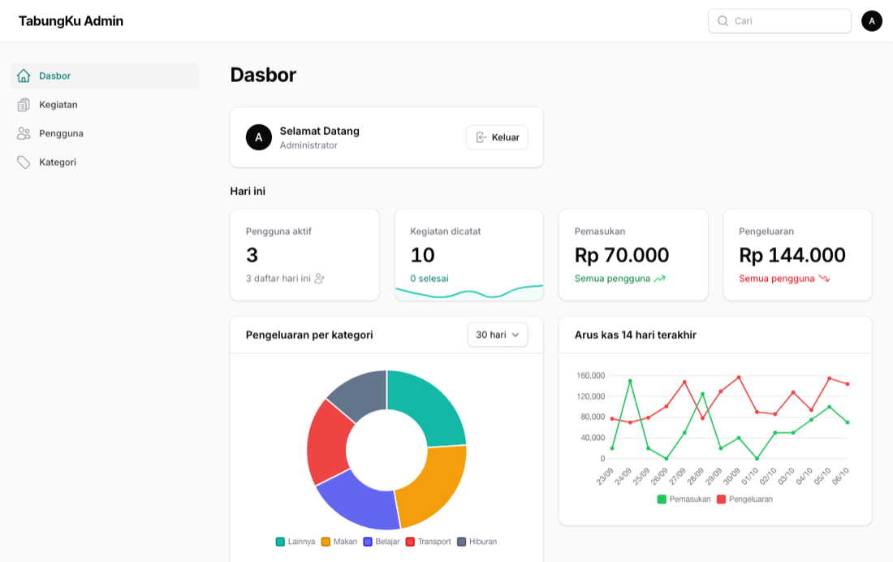
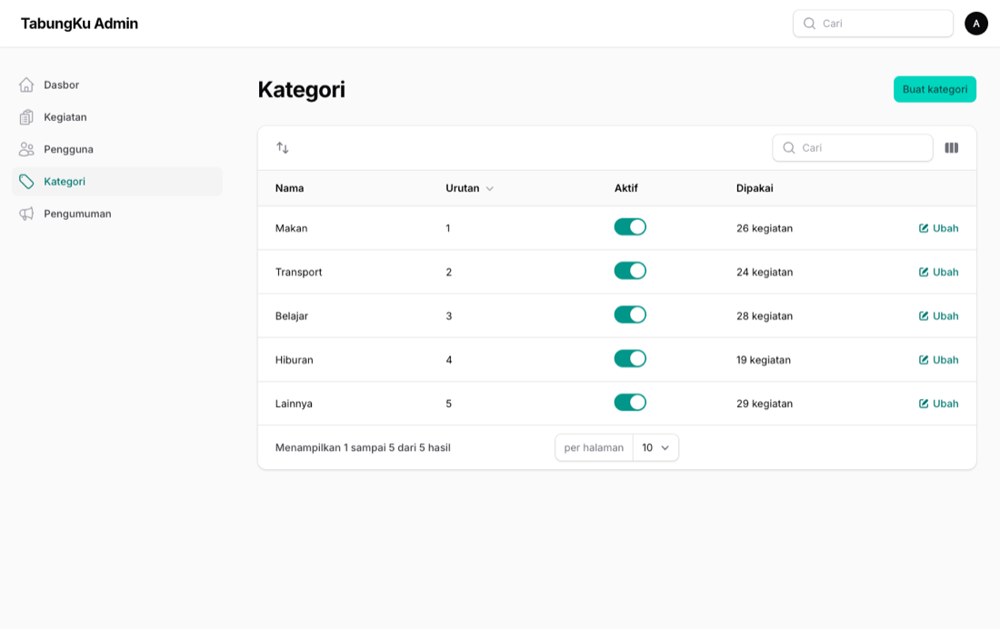
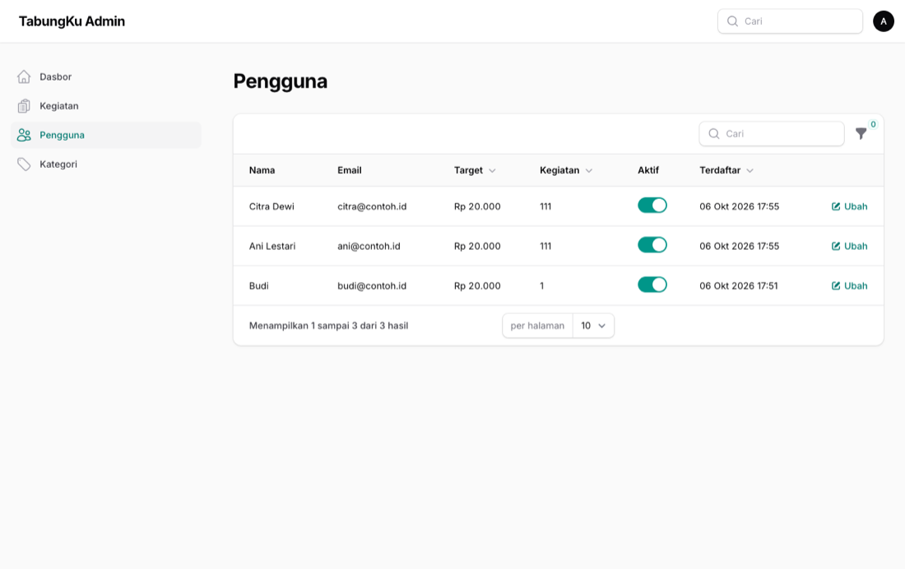
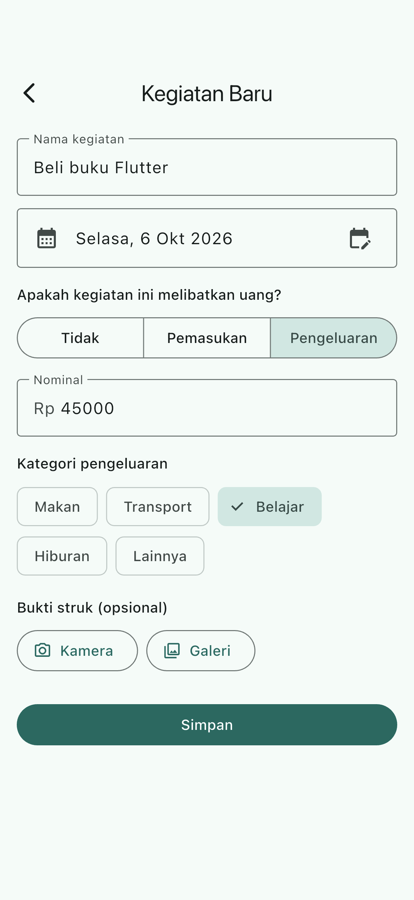

# Tugas Pertemuan 12 — Dashboard Filament

Kategori dipindah ke tabel master (migrasi data teks → `kategori_id`), lalu dashboard **Laravel 13 + Filament 5** ditambahkan ke Docker Compose dengan database yang sama. Tugas menambahkan widget statistik, dua grafik, dan filter tabel.

- **Kode:** [`../tugas12/`](../tugas12/) — `admin/app/Filament/`, `admin/app/Models/`, `backend/alembic/versions/0003_tabel_kategori.py`
- **Modul:** [Pertemuan 12](../modul/modul-praktikum-flutter-pertemuan-12.pdf), bagian 7 (Tugas)

## Tangkapan Layar

| Dashboard (widget tugas) |
|---|
|  |

| Kategori (drag untuk mengurutkan) | Pengguna (saklar aktif) |
|---|---|
|  |  |

| Chip kategori dari server |
|---|
|  |

## Pemenuhan Ketentuan Tugas

| Ketentuan | Implementasi |
|---|---|
| Statistik hari ini (pengguna aktif, kegiatan + sparkline, pemasukan, pengeluaran) | `Widgets/StatistikHariIni.php` (`Number::currency` IDR) |
| Donat pengeluaran per kategori + pilihan 7/30/365 hari | `Widgets/PengeluaranPerKategoriChart.php` (`getFilters()`) |
| Garis arus kas 14 hari, hari kosong = 0 | `Widgets/ArusKasChart.php` |
| Filter kategori, pengguna (dapat dicari), rentang tanggal + indikator | `KegiatanResource::table()` |
| Feature test widget dan filter | `admin/tests/Feature/DashboardTest.php` (6 test) |

## Cara Menjalankan

```bash
cd pert12/tugas12 && cp .env.example .env && docker compose up -d --build
docker compose exec api python -m scripts.seed_demo     # data contoh (password rahasia123)
# dashboard: http://localhost:8080/admin  (admin@tabungku.test / admin12345)
docker compose exec admin php artisan test
```

## Hasil Verifikasi

- Migrasi 0003 memindahkan data lama dengan benar (Angkot → Transport), lalu `downgrade`/`upgrade`/`check` bersih.
- Uji ujung ke ujung: kategori "Kos" yang dibuat lewat aksi Filament langsung muncul di `GET /kategori`; menonaktifkan pengguna lewat `ToggleColumn` membuat login API dibalas "Akun dinonaktifkan oleh admin".
- `php artisan test`: 6 test lulus; `flutter test`: 42 test lulus.
