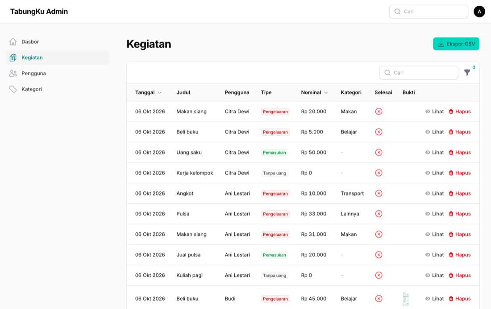
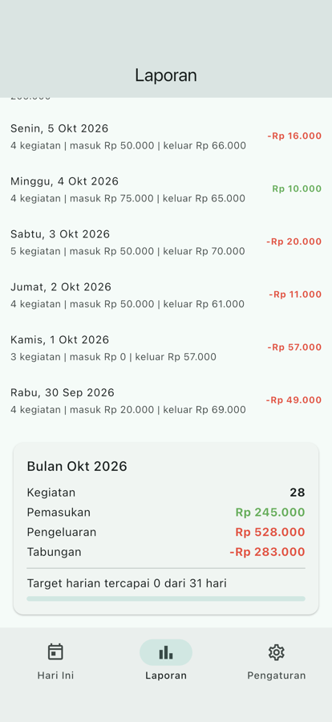

# Tugas Pertemuan 13 — Laporan Bulanan dan Ekspor CSV

Foto bukti struk (unggah aman di FastAPI, kamera/galeri di Flutter, *thumbnail* di Filament) dan suite pytest. Tugas menambahkan laporan bulanan, ekspor CSV dari API dan dashboard, serta kartu bulanan di aplikasi.

- **Kode:** [`../tugas13/`](../tugas13/) — `backend/app/routers/laporan.py`, `backend/tests/`, `admin/app/Filament/Resources/Kegiatans/Pages/ManageKegiatans.php`
- **Modul:** [Pertemuan 13](../modul/modul-praktikum-flutter-pertemuan-13.pdf), bagian 6 (Tugas)

## Tangkapan Layar

| Tabel kegiatan: tombol Ekspor CSV dan *thumbnail* bukti |
|---|
|  |

| Kartu bulanan |
|---|
|  |

## Pemenuhan Ketentuan Tugas

| Ketentuan | Implementasi |
|---|---|
| `GET /laporan/bulanan` + `hari_target_tercapai` | Memakai ulang `_ringkasan_per_tanggal`; hanya hari yang sudah lewat dihitung |
| `GET /laporan/ekspor.csv` maks 366 hari | `StreamingResponse` + `Content-Disposition: attachment` |
| Test + cakupan ≥ 85% | 25 test; `pytest --cov`: **96%** |
| Ekspor Filament sesuai filter aktif | `getFilteredSortedTableQuery()` + `streamDownload` + `lazy()` |
| Kartu "Bulan ini" di Flutter | `_KartuBulanan` di `laporan_page.dart`; mode lokal dihitung dari SQLite |

## Hasil Verifikasi

- Unggah PNG asli lewat `curl` → `uploads/<uuid>.png` dapat diunduh; PDF/teks palsu 415; > 2 MB 413.
- Ekspor dashboard dengan filter `pengeluaran` hanya memuat baris pengeluaran (diperiksa isi CSV-nya).
- `pytest`: 25 lulus; `php artisan test`: 8 lulus; `flutter test`: 46 lulus; APK debug dengan `image_picker` berhasil di-build.
