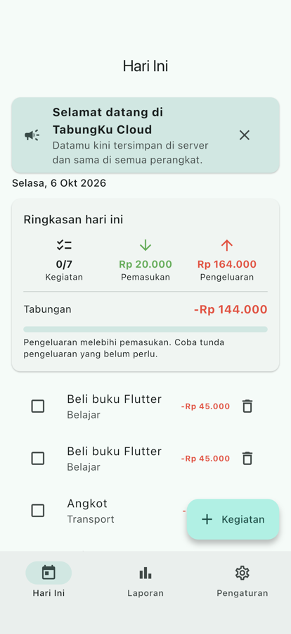
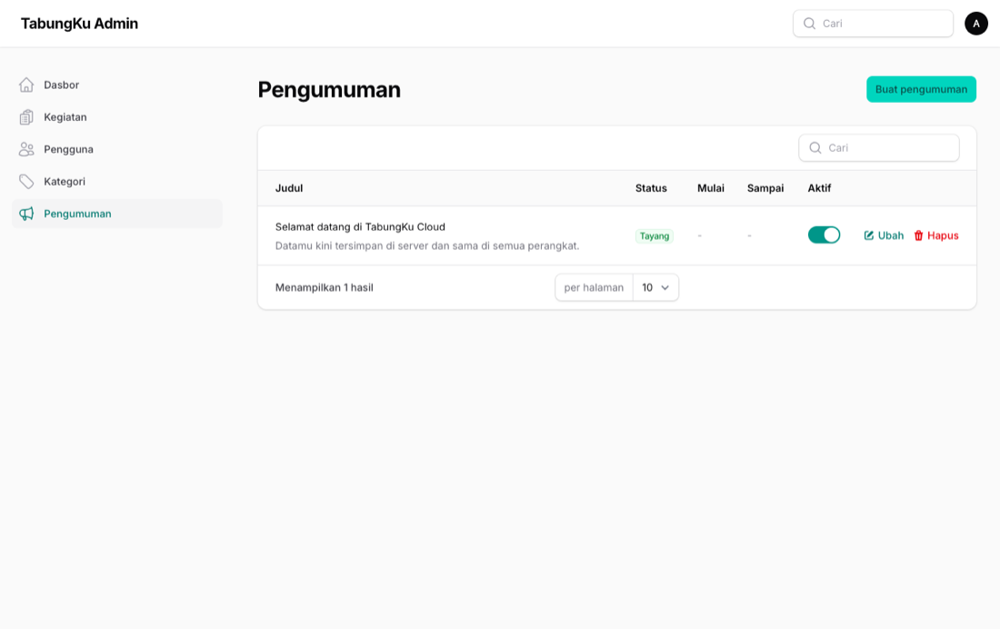
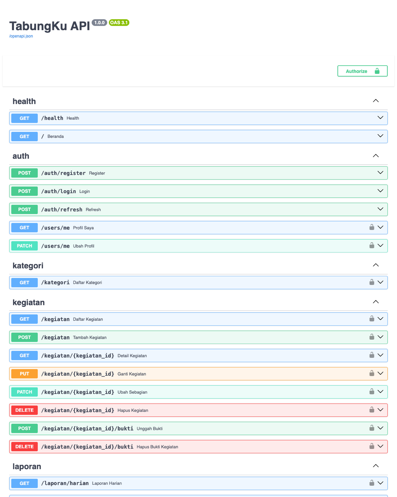

# Tugas Pertemuan 14 — Contoh Proyek Akhir: Pengumuman

Contoh fitur proyek akhir yang menyentuh ketiga lapisan: admin membuat **pengumuman** di Filament (dengan rentang tayang), API menyajikannya, dan aplikasi menampilkannya sebagai banner yang dapat ditutup. Snapshot ini juga berisi konfigurasi produksi (Nginx, rate limit, backup, CI) dari praktikum 14 dan uji *end-to-end*.

- **Kode:** [`../tugas14/`](../tugas14/)
- **Modul:** [Pertemuan 14](../modul/modul-praktikum-flutter-pertemuan-14.pdf), bagian 5 (Proyek Akhir)

## Tangkapan Layar

| Banner pengumuman di aplikasi | Pengumuman di Filament |
|---|---|
|  |  |

Daftar endpoint akhir (Swagger, mode pengembangan; di produksi `/docs` dimatikan):



## Fitur Pengumuman di Tiga Lapisan

| Lapisan | Berkas |
|---|---|
| Database | `backend/alembic/versions/0005_tabel_pengumuman.py` (`judul`, `isi`, `aktif`, `mulai`, `sampai`) |
| API | `backend/app/routers/pengumuman.py`: `GET /pengumuman` (wajib login, aktif dan dalam rentang, maks 5) |
| Dashboard | `admin/app/Filament/Resources/Pengumumen/`: CRUD + status Tayang/Terjadwal/Berakhir/Nonaktif |
| Aplikasi | `mobile/lib/widgets/pengumuman_banner.dart`: yang ditutup diingat dengan `shared_preferences` |
| Test | `backend/tests/test_pengumuman.py`, `admin/tests/Feature/DashboardTest.php`, `mobile/test/pengumuman_test.dart` |

> Generator Filament menamai folder `Pengumumen` (aturan jamak bahasa Inggris *man* → *men*). URL diperbaiki dengan `$slug = 'pengumuman'`.

## Cara Menjalankan

```bash
cd pert14/tugas14 && cp .env.example .env
# pengembangan
docker compose up -d --build
docker compose exec api python -m scripts.seed_demo
# produksi (hentikan stack pengembangan dulu; GANTI semua rahasia di .env)
docker compose down
docker compose -f docker-compose.prod.yml up -d --build    # http://localhost/ dan /api
sh scripts/backup.sh docker-compose.prod.yml
# uji end-to-end (stack pengembangan + simulator/emulator)
cd mobile && flutter drive --driver=test_driver/integration_test.dart \
  --target=integration_test/alur_test.dart --dart-define=API_URL=http://localhost:8000
```

## Hasil Verifikasi

| Uji | Hasil |
|---|---|
| `pytest` (container bersih, seperti CI) | 30 lulus |
| `php artisan test` | 9 lulus |
| `flutter test` / `flutter analyze` | 48 lulus / tanpa masalah |
| Uji *end-to-end* di simulator iPhone terhadap Docker | Lulus: login, banner, tambah pengeluaran berkategori, laporan + kartu bulanan, pengaturan, status server |
| Start dari volume kosong | Siap dalam ±25 detik; migrasi 0001–0005 berjalan otomatis |
| Daftar periksa keamanan (modul bagian E) pada `docker-compose.prod.yml` | `/api/docs` 404, MySQL tidak terekspos, header keamanan ada, login ke-5 dibalas 429, API berjalan sebagai `uid=1000(app)`, Laravel production dengan debug OFF, 413 dari FastAPI dan Nginx, rahasia JWT lemah ditolak |
| Login Filament lewat Nginx dengan Chrome headless | Berhasil, tanpa galat HTTP maupun console |
| Backup → hapus data → restore | Kegiatan dan foto kembali |
