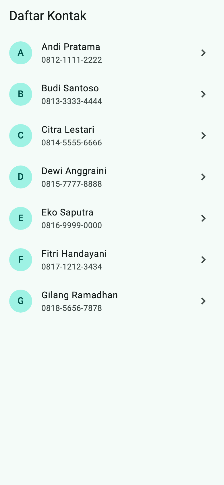
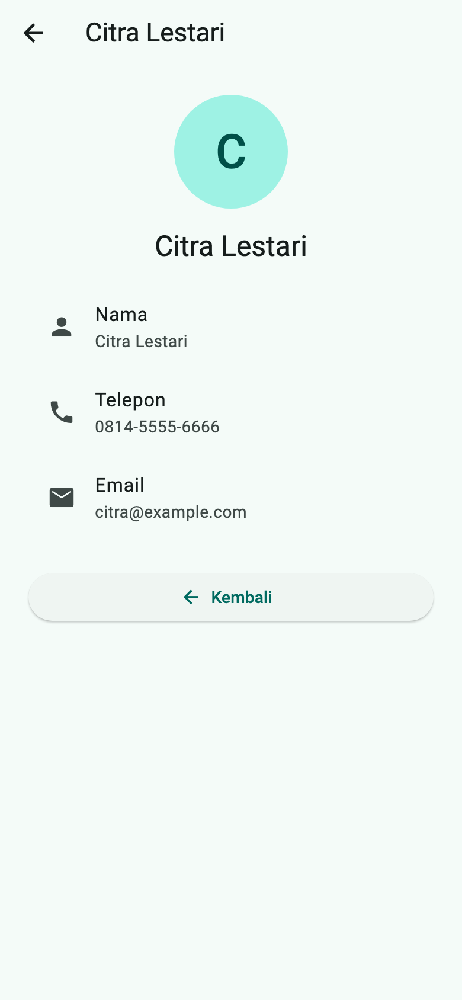

# Tugas Pertemuan 2 — Daftar Kontak

Aplikasi dua halaman: daftar kontak dan halaman detail kontak. Data kontak disimpan sebagai list berisi objek class `Kontak`.

- **Kode:** [`../tugas2/lib/main.dart`](../tugas2/lib/main.dart)
- **Materi:** model data dengan class, `ListView.builder`, `ListTile`, navigasi `Navigator.push`/`pop`
- **Modul:** [Pertemuan 2](../modul/modul-praktikum-flutter-pertemuan-2.pdf), bagian 6 (Tugas)

## Tangkapan Layar

| Daftar kontak | Detail kontak |
|---|---|
|  |  |

## Pemenuhan Ketentuan Tugas

| Ketentuan modul | Implementasi |
|---|---|
| Minimal 6 kontak (nama, telepon, email) dalam list objek class | 7 objek `Kontak` dalam `const daftarKontak` |
| Daftar memakai `ListView.builder` dan `ListTile` | `KontakPage` |
| Avatar berisi huruf pertama nama | `CircleAvatar(child: Text(kontak.inisial))`; getter `inisial` di class `Kontak` |
| Mengetuk kontak membuka halaman detail | `Navigator.push` ke `DetailKontakPage(kontak: kontak)` |
| Detail menampilkan seluruh data dan tombol kembali | Tiga `ListTile` (nama, telepon, email) dan tombol **Kembali** (`Navigator.pop`) |

## Struktur Kode

```
tugas2/
├── lib/main.dart          # model, data, dan dua halaman
└── test/widget_test.dart
```

| Bagian | Keterangan |
|---|---|
| `class Kontak` | Model data: `nama`, `telepon`, `email`, dan getter `inisial` |
| `daftarKontak` | List 7 kontak (data contoh) |
| `KontakPage` | Halaman utama dengan `ListView.builder` |
| `DetailKontakPage` | Menerima `Kontak` lewat constructor, lalu menampilkan seluruh datanya |

**Alur data:** objek `Kontak` yang diketuk dikirim lewat constructor `DetailKontakPage(kontak: kontak)`, sama seperti `DetailPage(makanan: item)` pada praktikum.

## Cara Menjalankan

```bash
cd pert2/tugas2
flutter pub get
flutter run
```

## Pengujian

| Test | Yang diperiksa |
|---|---|
| Daftar kontak membuka detail dan kembali | Minimal 6 kontak; avatar huruf awal tampil; detail menampilkan email; tombol Kembali menutup detail |

Hasil: semua test lulus; `flutter analyze` tanpa masalah.
