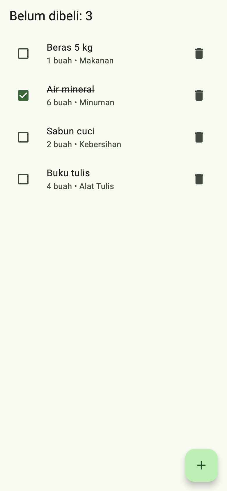
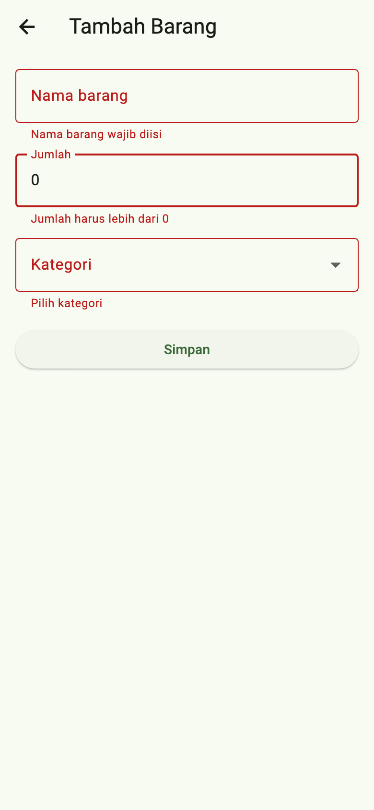
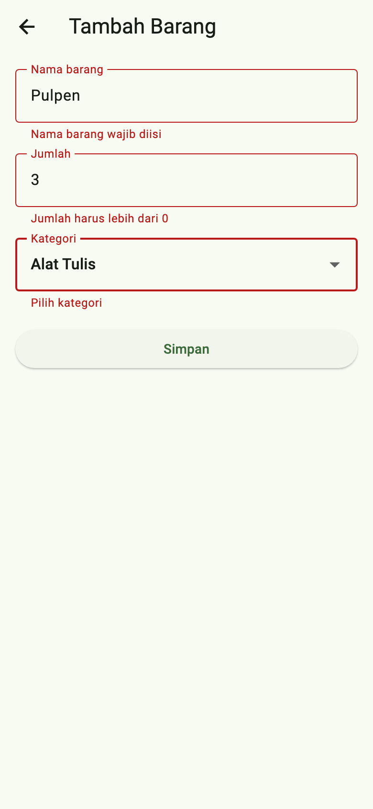

# Tugas Pertemuan 3 — Daftar Belanja

Aplikasi daftar belanja dengan form tambah yang tervalidasi. State disimpan pada satu `ChangeNotifier` dan dibagikan ke dua halaman dengan Provider.

- **Kode:** [`../tugas3/lib/main.dart`](../tugas3/lib/main.dart)
- **Paket:** `provider`
- **Materi:** `Form` dan validasi, `TextFormField`, `DropdownButtonFormField`, `ChangeNotifier`, `context.watch`/`context.read`
- **Modul:** [Pertemuan 3](../modul/modul-praktikum-flutter-pertemuan-3.pdf), bagian 6 (Tugas)

## Tangkapan Layar

| Daftar | Pesan error validasi | Form terisi |
|---|---|---|
|  |  |  |

## Pemenuhan Ketentuan Tugas

| Ketentuan modul | Implementasi |
|---|---|
| Form: nama barang (wajib) | `TextFormField`; error "Nama barang wajib diisi" |
| Form: jumlah (wajib, angka > 0) | Validator memeriksa kosong, bukan angka (`int.tryParse`), dan ≤ 0 |
| Form: kategori (dropdown) dengan validasi | `DropdownButtonFormField`; error "Pilih kategori" |
| Daftar dapat dicentang "sudah dibeli" dan dihapus | `Checkbox` memanggil `toggle(i)` (teks dicoret); ikon sampah memanggil `hapus(i)` |
| State pada satu `ChangeNotifier`, dibagikan dengan Provider | `BelanjaModel` di dalam `ChangeNotifierProvider` di atas `MaterialApp` |
| AppBar menampilkan jumlah barang belum dibeli | Judul `Belum dibeli: ${model.jumlahBelumDibeli}` |

## Struktur Kode

```
tugas3/
├── lib/main.dart          # model, state, dan dua halaman
└── test/widget_test.dart
```

| Bagian | Keterangan |
|---|---|
| `class Barang` | `nama`, `jumlah`, `kategori`, `dibeli` |
| `class BelanjaModel extends ChangeNotifier` | `items`, `jumlahBelumDibeli`, `tambah()`, `toggle()`, `hapus()`; setiap perubahan memanggil `notifyListeners()` |
| `DaftarPage` | `context.watch<BelanjaModel>()` di `build`; `context.read` di callback |
| `FormTambahPage` | `Form` + `GlobalKey<FormState>`; controller di-*dispose*; SnackBar "Barang ditambahkan" setelah simpan |

**Alur state:** `FormTambahPage` menambah barang dengan `context.read<BelanjaModel>().tambah(...)`. `notifyListeners()` membuat `DaftarPage`, yang memakai `context.watch`, dibangun ulang, sehingga barang baru langsung muncul.

## Cara Menjalankan

```bash
cd pert3/tugas3
flutter pub get
flutter run
```

## Pengujian

| Test | Yang diperiksa |
|---|---|
| Validasi form, tambah, centang, dan hapus barang | Tiga pesan error saat form kosong; jumlah 0 ditolak; barang valid tersimpan; AppBar berubah 0 → 1 → 0 saat dicentang; hapus mengosongkan daftar |

Hasil: semua test lulus; `flutter analyze` tanpa masalah.
