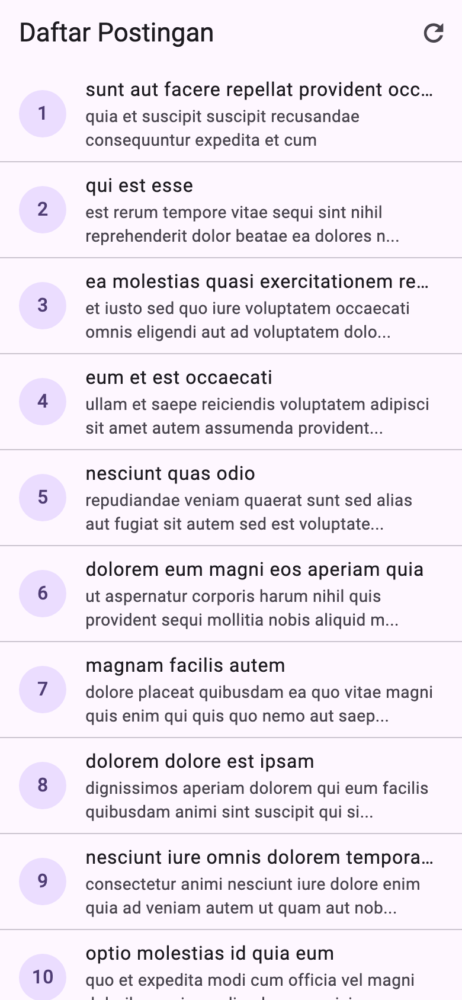
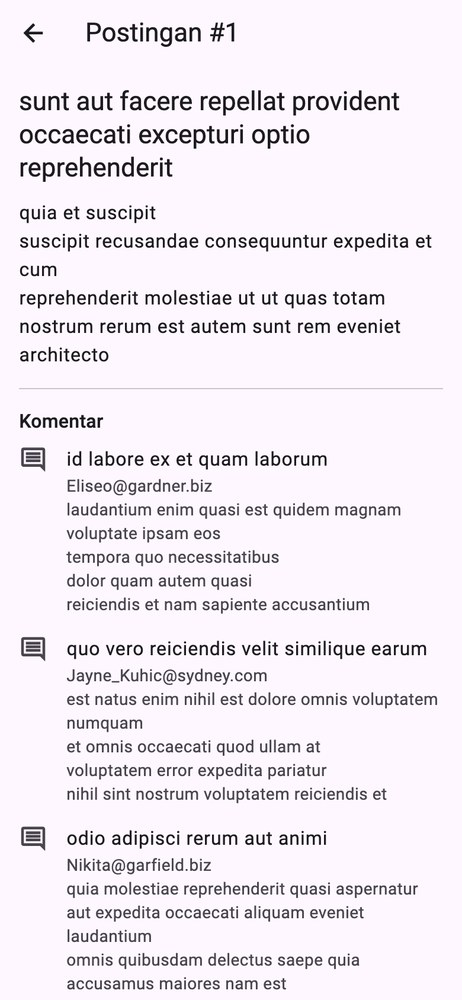
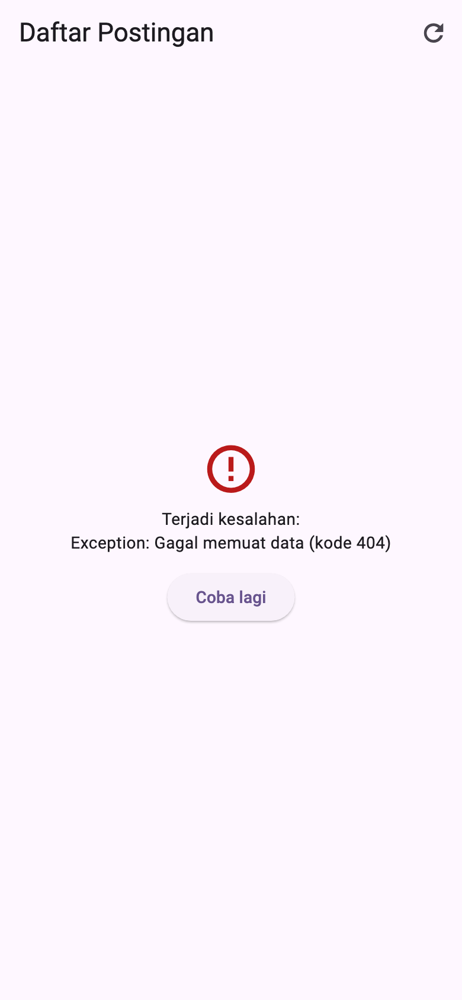

# Tugas Pertemuan 4 — Daftar Postingan

Aplikasi yang mengambil daftar postingan dari REST API [JSONPlaceholder](https://jsonplaceholder.typicode.com). Halaman detail mengambil komentar dari endpoint terpisah.

- **Kode:** [`../tugas4/lib/`](../tugas4/lib/)
- **Paket:** `http`
- **Endpoint:** `GET /posts` dan `GET /posts/{id}/comments`
- **Materi:** `Future`/`async`/`await`, `http`, `jsonDecode`, `fromJson`, `FutureBuilder`, penanganan galat
- **Modul:** [Pertemuan 4](../modul/modul-praktikum-flutter-pertemuan-4.pdf), bagian 6 (Tugas)

## Tangkapan Layar

| Daftar postingan | Detail + komentar | Tampilan galat |
|---|---|---|
|  |  |  |

## Pemenuhan Ketentuan Tugas

| Ketentuan modul | Implementasi |
|---|---|
| Daftar postingan (judul dan potongan isi) dengan `FutureBuilder` | `PostListPage`; getter `Post.potongan` memotong isi menjadi 80 karakter |
| Detail: isi lengkap dan komentar dari endpoint terpisah (Future kedua) | `PostDetailPage` menampilkan `post.body` dan `FutureBuilder` kedua untuk `ambilKomentar(post.id)` |
| Model `Post` dan `Komentar` dengan `fromJson` | `lib/models/post.dart`, `lib/models/komentar.dart` |
| Kode pengambil data terpisah dari UI | `lib/services/api_service.dart` (`ApiService`) |
| Status loading dan galat di kedua halaman, dengan tombol coba lagi | Widget bersama `MemuatView` dan `GalatView` (`lib/widgets/status_widgets.dart`) |

## Struktur Kode

```
tugas4/lib/
├── main.dart                    # MaterialApp; membuat ApiService
├── models/
│   ├── post.dart                # Post.fromJson, getter potongan
│   └── komentar.dart            # Komentar.fromJson
├── services/
│   └── api_service.dart         # ambilPosts(), ambilKomentar(postId)
├── pages/
│   ├── post_list_page.dart      # FutureBuilder daftar + tombol refresh
│   └── post_detail_page.dart    # isi lengkap + FutureBuilder komentar
└── widgets/
    └── status_widgets.dart      # MemuatView, GalatView (tombol Coba lagi)
```

**Catatan desain:**
- `Future` dibuat di `initState()` dan diganti di dalam `setState()` saat muat ulang, bukan di `build()`. Dengan begitu data tidak diambil ulang setiap kali layar dibangun ulang.
- `ApiService` melempar `Exception` bila status bukan 200. Galat ditangkap `snapshot.hasError` lalu ditampilkan `GalatView`.
- `ApiService` menerima `http.Client` lewat constructor, sehingga pengujian dapat memakai `MockClient` tanpa internet.
- Izin `INTERNET` (Android) dan `com.apple.security.network.client` (macOS) sudah ditambahkan.

## Cara Menjalankan

```bash
cd pert4/tugas4
flutter pub get
flutter run
```

Untuk mencoba tampilan galat: matikan internet emulator lalu tekan tombol refresh, atau ubah path `/posts` di `api_service.dart` menjadi `/postz`.

## Pengujian

Pengujian memakai `MockClient` dari `package:http/testing.dart`, jadi tidak memerlukan internet.

| Test | Yang diperiksa |
|---|---|
| Daftar postingan dan detail dengan komentar | Daftar tampil; mengetuk postingan menampilkan isi lengkap dan komentar |
| Galat menampilkan tombol coba lagi yang berfungsi | Respons 500 menampilkan pesan galat; *Coba lagi* memuat ulang hingga berhasil |

Hasil: semua test lulus; `flutter analyze` tanpa masalah; `flutter build apk --debug` berhasil.
