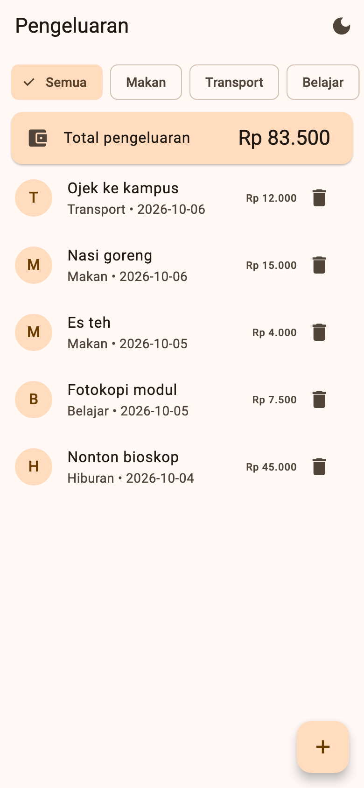
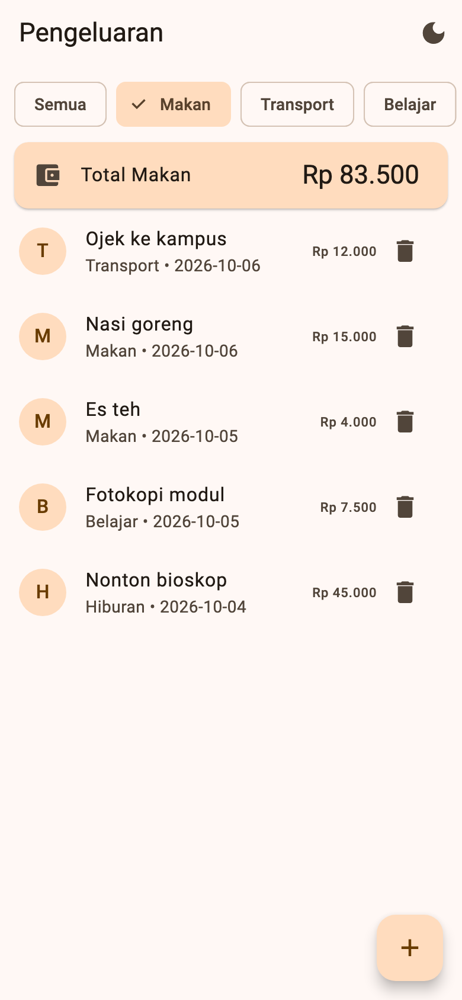
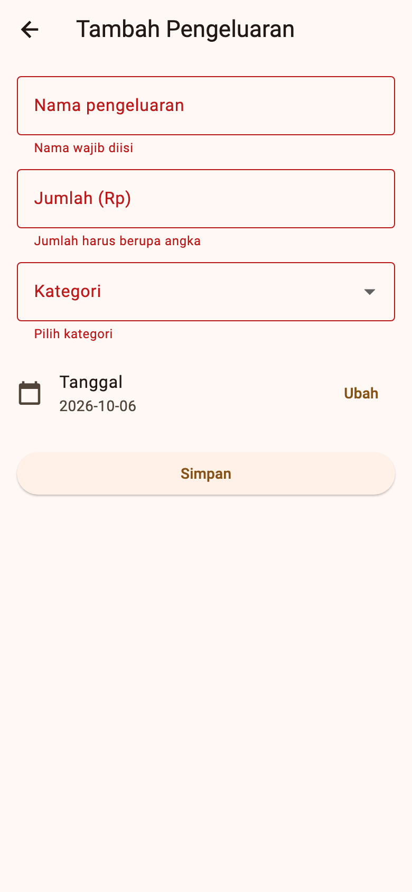
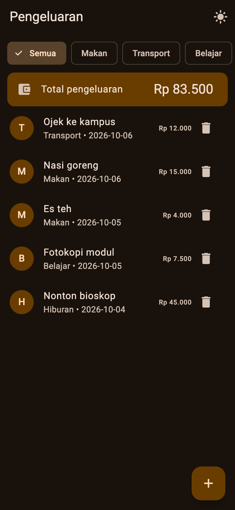

# Tugas Pertemuan 5 — Pencatat Pengeluaran

Aplikasi pencatat pengeluaran dengan CRUD lengkap di SQLite. Total pengeluaran dihitung dengan `SUM`. Mode gelap dan filter kategori terakhir disimpan dengan `shared_preferences`.

- **Kode:** [`../tugas5/lib/`](../tugas5/lib/)
- **Paket:** `sqflite`, `path`, `shared_preferences` (pengujian: `sqflite_common_ffi`)
- **Materi:** SQLite (`CREATE`, `INSERT`, `SELECT`, `UPDATE`, `DELETE`, `SUM`), `shared_preferences`, form validasi, date picker
- **Modul:** [Pertemuan 5](../modul/modul-praktikum-flutter-pertemuan-5.pdf), bagian 6 (Tugas)

## Tangkapan Layar

| Daftar + total | Filter kategori | Validasi form |
|---|---|---|
|  |  |  |

| Form ubah | Mode gelap |
|---|---|
|  |  |

> Bukti data bertahan setelah restart perlu diambil langsung di emulator/perangkat: tambah data, hentikan aplikasi sepenuhnya, lalu jalankan lagi.

## Pemenuhan Ketentuan Tugas

| Ketentuan modul | Implementasi |
|---|---|
| Tabel `pengeluaran`: `id`, `nama`, `jumlah` (integer), `kategori`, `tanggal` | `onCreate` di `DbHelper.database` |
| CRUD lengkap | `tambah()`, `semua()`, `ubah()`, `hapus()`; hapus memakai konfirmasi `AlertDialog` |
| Validasi: nama wajib | "Nama wajib diisi" |
| Validasi: jumlah angka > 0 | "Jumlah harus berupa angka" / "Jumlah harus lebih dari 0" |
| Validasi: kategori dari dropdown | `DropdownButtonFormField` dengan 5 kategori; "Pilih kategori" |
| Total pengeluaran di halaman utama | `DbHelper.total()` memakai `SELECT COALESCE(SUM(jumlah), 0)`, mengikuti filter kategori |
| Satu pengaturan disimpan dengan `shared_preferences` | Dua pengaturan: mode gelap (`gelap`) dan filter kategori terakhir (`filterKategori`) |
| Data tetap ada setelah aplikasi ditutup | Data di SQLite (`pengeluaran.db`), pengaturan di `shared_preferences` |

## Struktur Kode

```
tugas5/lib/
├── main.dart                 # tema terang/gelap, modeGelap (ValueNotifier) + simpan
├── models/
│   └── pengeluaran.dart      # Pengeluaran (toMap/fromMap), daftarKategori, fmtTanggal, rupiah
├── data/
│   └── db_helper.dart        # SQLite: CRUD + total (SUM)
└── pages/
    ├── daftar_page.dart      # filter chip, kartu total, daftar, hapus dengan konfirmasi
    └── form_page.dart        # satu form untuk tambah dan ubah, date picker
```

**Catatan desain:**
- Query memakai placeholder `?` dan `whereArgs`, tidak menyambung teks, sehingga aman dari SQL injection.
- Tanggal disimpan sebagai teks `yyyy-MM-dd` agar dapat diurutkan (`ORDER BY tanggal DESC, id DESC`).
- `FormPage` dipakai untuk dua keperluan: `data == null` berarti tambah, terisi berarti ubah. Setelah kembali dari form, daftar dan total dimuat ulang dengan `_muat()`.
- `COALESCE(..., 0)` mencegah total bernilai `NULL` saat tabel kosong.

## Cara Menjalankan

```bash
cd pert5/tugas5
flutter pub get
flutter run        # Android/iOS/macOS; sqflite tidak mendukung web
```

## Pengujian

Logika database diuji di desktop dengan `sqflite_common_ffi`.

| Test | Yang diperiksa |
|---|---|
| Total kosong bernilai 0 | `COALESCE` bekerja |
| CRUD dan total dengan filter kategori | Tambah, urutan terbaru di atas, total semua dan per kategori, ubah memperbarui total, hapus mengurangi total |
| Format rupiah dan tanggal | `rupiah(1500000)` → `Rp 1.500.000`; `fmtTanggal` → `2026-01-09` |

Hasil: semua test lulus; `flutter analyze` tanpa masalah; `flutter build apk --debug` berhasil.
