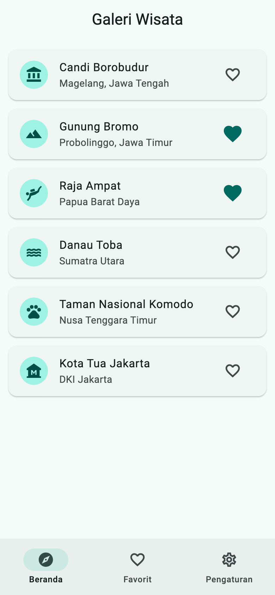
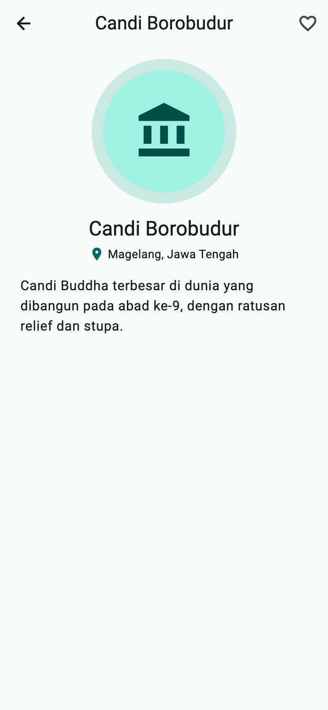
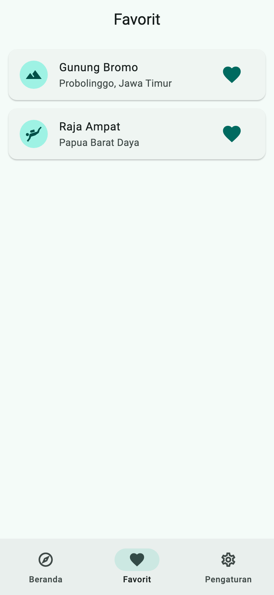
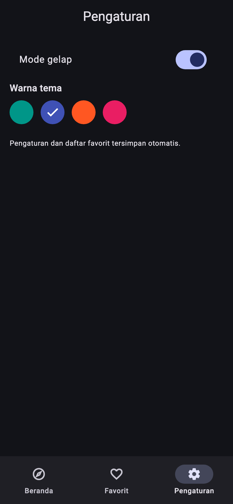
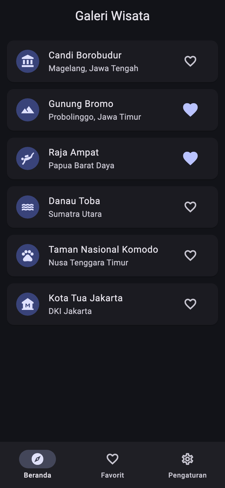

# Tugas Pertemuan 6 — Galeri Wisata Indonesia

Aplikasi galeri/katalog interaktif bertema tempat wisata Indonesia. Aplikasi memiliki tiga tab, halaman detail dengan transisi Hero, dua jenis animasi, dan pengaturan tema yang tersimpan.

- **Kode:** [`../tugas6/lib/`](../tugas6/lib/)
- **Paket:** `shared_preferences`
- **Materi:** `ThemeData`/`ColorScheme`, named routes + `onGenerateRoute`, `Hero`, `NavigationBar` + `IndexedStack`, animasi implisit dan eksplisit
- **Modul:** [Pertemuan 6](../modul/modul-praktikum-flutter-pertemuan-6.pdf), bagian 6 (Tugas)

## Tangkapan Layar

| Beranda (terang) | Detail (Hero) | Favorit |
|---|---|---|
|  |  |  |

| Pengaturan (gelap, warna indigo) | Beranda (gelap) |
|---|---|
|  |  |

## Pemenuhan Ketentuan Tugas

| Ketentuan modul | Implementasi |
|---|---|
| Minimal 3 tab dengan `NavigationBar` | `ShellPage`: Beranda, Favorit, Pengaturan; `IndexedStack` menjaga state tiap tab |
| Named routes dengan argumen ke halaman detail | Rute `'/detail'` ditangani `onGenerateRoute`; argumen `DetailArgs(wisata, heroTag)` |
| Halaman detail memakai `Hero` | Avatar ikon "terbang" dari daftar ke detail |
| Animasi implisit | `TombolFavorit`: `AnimatedScale` + `AnimatedSwitcher` saat ikon hati ditekan |
| Animasi eksplisit (`AnimationController`) | `DetailPage`: lingkaran berdenyut (`ScaleTransition`, `repeat(reverse: true)`), controller di-*dispose* |
| Tema terang/gelap dan minimal 3 warna, tersimpan | Saklar mode gelap + 4 warna; disimpan dengan `shared_preferences` (`gelap`, `warna` sebagai indeks) |
| Warna dan gaya teks dari `Theme.of(context)` | Teks memakai `textTheme`, latar/avatar memakai `colorScheme`. Pengecualian: lingkaran contoh warna di Pengaturan (memang menampilkan warna pilihan) |
| Tambahan | Daftar favorit juga tersimpan (`favorit`) |

## Struktur Kode

```
tugas6/lib/
├── main.dart                 # MaterialApp + ListenableBuilder tema, routes, onGenerateRoute
├── data/
│   └── wisata.dart           # model Wisata + 6 data tempat wisata
├── state/
│   └── pengaturan.dart       # themeMode, seedColor, favorit (ValueNotifier) + simpan/muat
└── pages/
    ├── shell_page.dart       # NavigationBar + IndexedStack
    ├── beranda_page.dart     # WisataTile (Hero), TombolFavorit (animasi implisit)
    ├── favorit_page.dart     # daftar wisata favorit
    ├── pengaturan_page.dart  # saklar gelap + pilihan warna
    └── detail_page.dart      # DetailArgs, Hero, animasi eksplisit
```

**Catatan desain:**
- **Tag Hero unik per tab.** Beranda dan Favorit hidup bersamaan di `IndexedStack`, sehingga satu tempat wisata bisa tampil dua kali di route yang sama. Tag Hero diberi awalan tab asal (`beranda-borobudur`, `favorit-borobudur`) dan dikirim ke detail lewat `DetailArgs`. Tanpa itu Flutter memunculkan error *"multiple heroes that share the same tag"*. Kasus ini dijaga oleh test regresi.
- Pengaturan dimuat di `main()` setelah `WidgetsFlutterBinding.ensureInitialized()`, sehingga tema sudah benar sejak frame pertama.
- Warna disimpan sebagai **indeks** `pilihanWarna`, bukan `Color.value` yang sudah *deprecated*.

## Cara Menjalankan

```bash
cd pert6/tugas6
flutter pub get
flutter run
```

## Pengujian

| Test | Yang diperiksa |
|---|---|
| Tab, detail, favorit, dan pengaturan tersimpan | Detail lewat named route; favorit muncul di tab Favorit; mode gelap dan favorit tersimpan di `shared_preferences` |
| Detail dari Beranda tetap aman saat ada favorit | Tidak ada error tag Hero ganda |

Hasil: semua test lulus; `flutter analyze` tanpa masalah; `flutter build apk --debug` berhasil.
