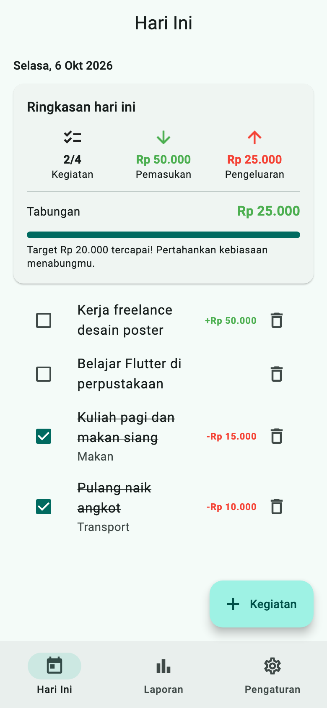
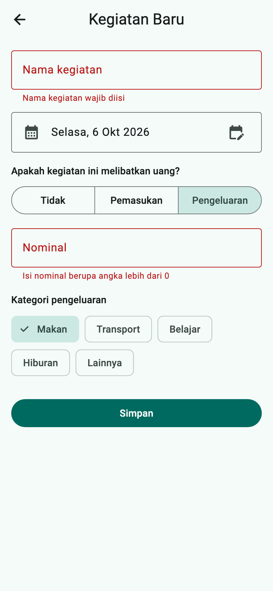
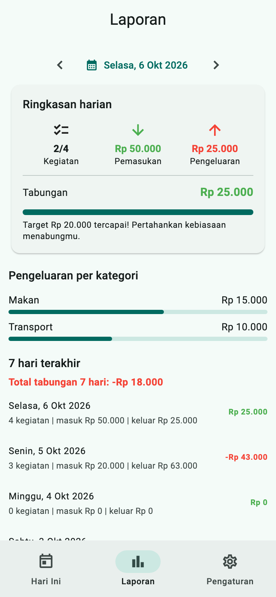
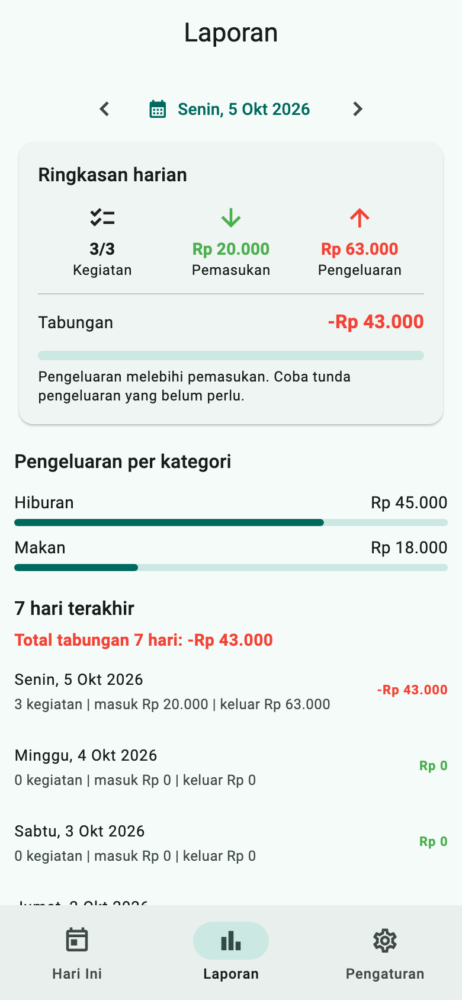
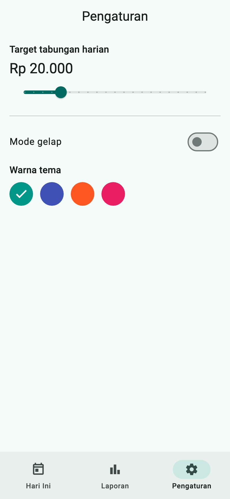
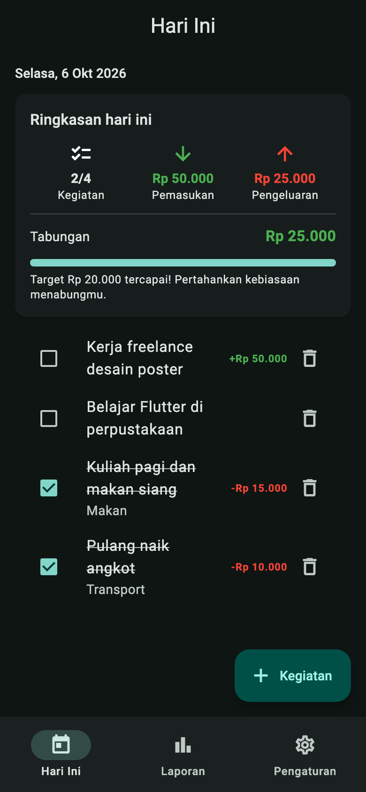

# TabungKu — Mini Proyek Pertemuan 7

**TabungKu** adalah aplikasi *to-do list* kegiatan harian mahasiswa. Setiap kegiatan dapat dicatat keuangannya: tanpa uang, pemasukan, atau pengeluaran. Aplikasi meringkasnya menjadi laporan harian dan membandingkan tabungan hari itu dengan target menabung, untuk melatih kebiasaan menabung.

- **Kode:** [`../praktikum7/lib/`](../praktikum7/lib/) (contoh solusi)
- **Paket:** `sqflite`, `path`, `shared_preferences` (pengujian: `sqflite_common_ffi`)
- **Modul:** [Pertemuan 7](../modul/modul-praktikum-flutter-pertemuan-7.pdf)
- **Materi yang diintegrasikan:** widget dan layout (P1–2), form dan validasi (P3), `Future`/`FutureBuilder` (P4), SQLite dan `shared_preferences` (P5), tema, *named routes*, `NavigationBar`, dan animasi (P6)

## Tangkapan Layar

| Hari Ini | Form (pesan kesalahan) | Laporan |
|---|---|---|
|  |  |  |

| Tabungan negatif | Pengaturan | Mode gelap |
|---|---|---|
|  |  |  |

Data pada tangkapan layar *Hari Ini* sama dengan **Contoh Skenario Satu Hari** di modul (bagian 3.2): 2 dari 4 kegiatan selesai, pemasukan Rp 50.000, pengeluaran Rp 25.000, tabungan Rp 25.000, sehingga target Rp 20.000 tercapai.

## Daftar Fitur

| Kode | Fitur wajib | Implementasi |
|---|---|---|
| F1 | Daftar kegiatan hari ini: centang selesai, ubah, hapus dengan konfirmasi | `BerandaPage` + `KegiatanTile`; judul dicoret bila selesai; dialog *Hapus kegiatan?* |
| F2 | Form tambah/ubah: nama, tanggal (*date picker*), jenis keuangan, nominal, kategori; tervalidasi | `FormKegiatanPage`; `SegmentedButton` jenis keuangan; nominal dan kategori hanya muncul bila relevan |
| F3 | Data tersimpan di SQLite | `DbHelper`, tabel `kegiatan` di `tabungku.db` |
| F4 | Ringkasan hari ini | `RingkasanCard`: selesai/total, pemasukan, pengeluaran, tabungan |
| F5 | Laporan: pilih tanggal, ringkasan, pengeluaran per kategori, 7 hari terakhir | `LaporanPage`: tombol ‹ › dan *date picker*; bilah per kategori; daftar 7 hari dan total tabungannya |
| F6 | Target tabungan harian + indikator kemajuan beranimasi | `TweenAnimationBuilder` + `LinearProgressIndicator`; pesan apresiasi atau peringatan |
| F7 | Pengaturan: mode gelap, warna tema, target; tersimpan | `PengaturanPage`; `shared_preferences` (`gelap`, `warna`, `target`) |
| F8 | Tiga tab (`NavigationBar`) dan form lewat *named route* | `ShellPage` + `IndexedStack`; rute `'/form'` dengan argumen `Kegiatan?` di `onGenerateRoute` |

**Pengembangan lanjutan (bagian 8 modul):** contoh solusi ini hanya mencakup fitur wajib F1–F8 dan belum mengimplementasikan fitur pengembangan lanjutan. Mahasiswa wajib memilih minimal 2, misalnya rencana vs realisasi, laporan bulanan, pencarian/filter, kategori kustom, kutipan motivasi dari API, kegiatan berulang, atau ekspor ke *clipboard*.

## Aturan Bisnis

- Tabungan harian = total pemasukan − total pengeluaran dari **semua** kegiatan pada tanggal itu, baik yang sudah selesai maupun belum.
- Nominal wajib berupa angka lebih dari 0 bila jenisnya pemasukan atau pengeluaran. Untuk jenis *Tidak*, nominal disimpan 0.
- Kategori (Makan, Transport, Belajar, Hiburan, Lainnya) hanya berlaku untuk pengeluaran. Jenis lain menyimpan `'-'`.
- Target tabungan bawaan Rp 20.000 dan dapat diubah di Pengaturan (Rp 0–100.000).
- Tabungan negatif ditampilkan merah dengan pesan peringatan. Bila target tercapai, aplikasi menampilkan pesan apresiasi.

## Rancangan Data

Tabel `kegiatan`:

| Kolom | Tipe | Keterangan |
|---|---|---|
| `id` | INTEGER, PK, AUTOINCREMENT | Kunci utama |
| `judul` | TEXT, NOT NULL | Nama kegiatan |
| `tanggal` | TEXT, NOT NULL | `yyyy-MM-dd`, agar mudah dibandingkan dan diurutkan |
| `selesai` | INTEGER (0/1) | SQLite tidak punya tipe boolean |
| `tipe` | TEXT | `tanpa`, `pemasukan`, atau `pengeluaran` (`Tipe.name`) |
| `nominal` | INTEGER | Rupiah bulat; 0 bila tanpa uang |
| `kategori` | TEXT | Hanya untuk pengeluaran; selain itu `'-'` |

Laporan dihitung langsung di database:
- `DbHelper.ringkasan(tanggal)` menghitung `COUNT`, `SUM(selesai)`, dan `SUM(CASE WHEN tipe = ... THEN nominal END)` dalam satu query. Hasilnya dibungkus `COALESCE(..., 0)` agar tanggal tanpa data menghasilkan 0, bukan `NULL`.
- `DbHelper.pengeluaranPerKategori(tanggal)` memakai `GROUP BY kategori`.

**Sinkronisasi antartab:** `data/db_helper.dart` memiliki variabel global `ValueNotifier<int> versiData` yang dinaikkan setiap kali ada tambah/ubah/hapus. Tab Hari Ini dan Laporan mendengarkannya (`addListener` di `initState`, `removeListener` di `dispose`) lalu memuat ulang `Future`-nya.

## Struktur Folder

```
praktikum7/lib/
├── main.dart                     tema + named routes ('/' dan '/form')
├── models/kegiatan.dart          Kegiatan (toMap/fromMap), Tipe, Ringkasan, kategoriPengeluaran
├── data/db_helper.dart           SQLite: CRUD, ringkasan(), pengeluaranPerKategori(), versiData
├── state/pengaturan.dart         themeMode, seedColor, targetHarian + shared_preferences
├── utils/format.dart             fmtTanggal, tampilTanggal, rupiah
├── widgets/
│   ├── ringkasan_card.dart       kartu ringkasan + progress target beranimasi
│   └── kegiatan_tile.dart        satu baris kegiatan
└── pages/
    ├── shell_page.dart           NavigationBar 3 tab + tombol tambah
    ├── beranda_page.dart         kegiatan hari ini + ringkasan
    ├── form_kegiatan_page.dart   tambah/ubah kegiatan (validasi)
    ├── laporan_page.dart         laporan per tanggal, per kategori, 7 hari
    └── pengaturan_page.dart      target, mode gelap, warna tema
```

## Cara Menjalankan

```bash
cd pert7/praktikum7
flutter pub get
flutter run          # Android/iOS/macOS; sqflite tidak mendukung web
flutter test         # pengujian logika database
```

Bila skema tabel diubah selama pengembangan, hapus data aplikasi (uninstall atau *Clear data*) atau naikkan `version` database dan tulis `onUpgrade`.

## Hasil Skenario Uji

Skenario dari bagian 7 modul. Kolom *Bukti* menunjukkan cara skenario diperiksa:
- **test** = `test/db_helper_test.dart`, pengujian otomatis logika database dengan `sqflite_common_ffi`.
- **UI** = diperiksa lewat pengujian widget saat tangkapan layar dibuat.
- **manual** = perlu dicoba langsung di emulator/perangkat.

| No | Langkah | Hasil yang diharapkan | Hasil | Bukti |
|:---:|---|---|:---:|---|
| 1 | Tambah kegiatan "Belajar" jenis Tidak | Muncul; jumlah kegiatan naik; uang tidak berubah | Lulus | test |
| 2 | Tambah Pemasukan Rp 50.000 | Pemasukan dan tabungan naik Rp 50.000; nominal hijau dengan tanda + | Lulus | test, UI (gambar 1) |
| 3 | Tambah Pengeluaran Rp 15.000 kategori Makan | Pengeluaran naik; tabungan turun; Makan muncul di Laporan | Lulus | test, UI (gambar 3) |
| 4 | Simpan dengan nama kosong / nominal kosong / 0 | Pesan kesalahan tampil; data tidak tersimpan | Lulus | UI (gambar 2) |
| 5 | Centang selesai dua kegiatan | Selesai/total benar; judul tercoret | Lulus | test, UI (gambar 1: 2/4) |
| 6 | Ubah nominal kegiatan | Ringkasan dan laporan berubah tanpa restart | Lulus | test (nilai berubah dan `versiData` naik) |
| 7 | Hapus kegiatan (Batal, lalu Hapus) | Batal tidak menghapus; Hapus menghapus | Sebagian | test (hapus). Tombol *Batal* perlu dicek **manual** |
| 8 | Tambah kegiatan bertanggal kemarin | Tidak muncul di Hari Ini; muncul di Laporan tanggal itu dan daftar 7 hari | Lulus | test, UI (gambar 3–4) |
| 9 | Ubah target, warna, mode gelap; tutup lalu buka lagi | Pengaturan dan data tetap | Belum diuji | **manual** (butuh restart aplikasi sungguhan) |
| 10 | Pengeluaran lebih besar dari pemasukan | Tabungan merah dan muncul peringatan | Lulus | test, UI (gambar 4) |

Selain itu: `flutter analyze` tanpa masalah dan `flutter build apk --debug` berhasil (Flutter 3.47.5).

## Catatan Perbaikan

Saat tangkapan layar dibuat, ditemukan bug tampilan di form: bila pesan *"Nama kegiatan wajib diisi"* muncul, **bingkai pemilih tanggal tertinggal di posisi lama dan menimpa pesan error**. Penyebabnya, `ListTile` menggambar `shape`-nya pada `Material` terdekat, yaitu milik `Scaffold` di luar `ListView`, sehingga bingkai tidak ikut bergeser saat isi form berubah tinggi. Perbaikannya: `ListTile` tanggal dibungkus `Material(type: MaterialType.transparency)` di `form_kegiatan_page.dart`. Gambar 2 sudah memakai versi yang diperbaiki.

Ini masalah yang sama dengan catatan Latihan 3 pada modul Pertemuan 2.

## Pertanyaan Refleksi (dari modul)

1. Mengapa tanggal disimpan sebagai teks `yyyy-MM-dd` dan bukan `dd/MM/yyyy`?
2. Mengapa laporan dihitung dengan `SUM` di database, bukan dijumlahkan di Dart? Kapan sebaliknya lebih tepat?
3. Bagaimana tiga tab selalu sinkron? Apa risikonya bila `removeListener` lupa dipanggil?
4. Apa dampak keputusan "semua kegiatan dihitung, bukan hanya yang selesai" terhadap kebiasaan menabung?
5. Bagian mana yang paling sulit, dan apa yang akan diubah bila mengerjakannya ulang?
