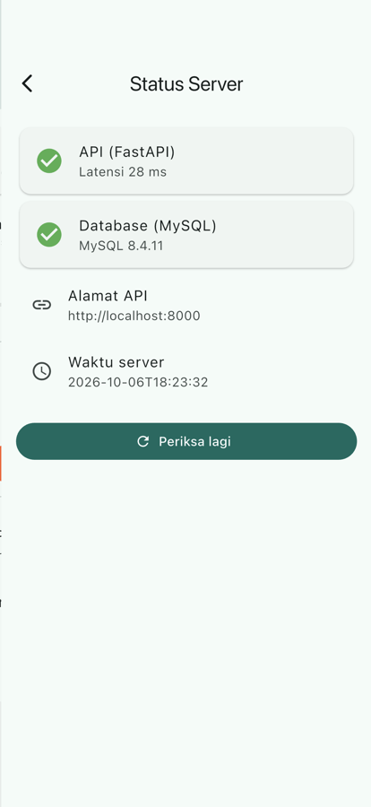

# Tugas Pertemuan 8 — Status Server dan Database

Stack Docker Compose pertama TabungKu Cloud: MySQL 8.4, FastAPI, dan Adminer. Endpoint `/health` memeriksa koneksi database, dan aplikasi Flutter menampilkan status API dan database secara terpisah.

- **Kode:** [`../tugas8/`](../tugas8/) (`docker-compose.yml`, `backend/`, `mobile/`)
- **Modul:** [Pertemuan 8](../modul/modul-praktikum-flutter-pertemuan-8.pdf), bagian 7 (Tugas)

## Tangkapan Layar

| Status Server |
|---|
|  |

## Pemenuhan Ketentuan Tugas

| Ketentuan | Implementasi |
|---|---|
| Layanan Adminer di port 8081 | `adminer:5` di `docker-compose.yml`, `ADMINER_DEFAULT_SERVER: mysql` |
| `/health` memeriksa database (`SELECT VERSION()`) | `backend/app/main.py`; membalas `database` dan `mysql_version` |
| 503 bila database mati | `JSONResponse(status_code=503, ...)` dengan `detail` dari galat SQLAlchemy |
| Status API dan database terpisah | `StatusServerPage` dengan dua kartu; 503 dibaca sebagai "API hidup, DB mati" |
| Alamat API dapat diubah dan tersimpan | Dialog di Pengaturan dengan validasi URL; `simpanApiUrl()` memakai `shared_preferences` |
| Unit test sehat / 503 / kode lain | `mobile/test/health_service_test.dart` dengan `MockClient` |

## Cara Menjalankan

```bash
cd pert8/tugas8
cp .env.example .env
docker compose up -d --build
curl localhost:8000/health        # {"status":"ok",...,"database":"ok"}
docker compose stop mysql && curl -i localhost:8000/health   # 503
docker compose start mysql

cd mobile && flutter create . --platforms android,ios   # sekali, membuat folder platform
flutter pub get && flutter run    # emulator Android memakai http://10.0.2.2:8000
```

## Hasil Verifikasi

- `docker compose up` berhasil; `/health` 200 saat sehat dan 503 saat MySQL dihentikan; Adminer 200.
- `flutter analyze` tanpa masalah; `flutter test`: 10 test lulus (termasuk test SQLite pertemuan 7).
